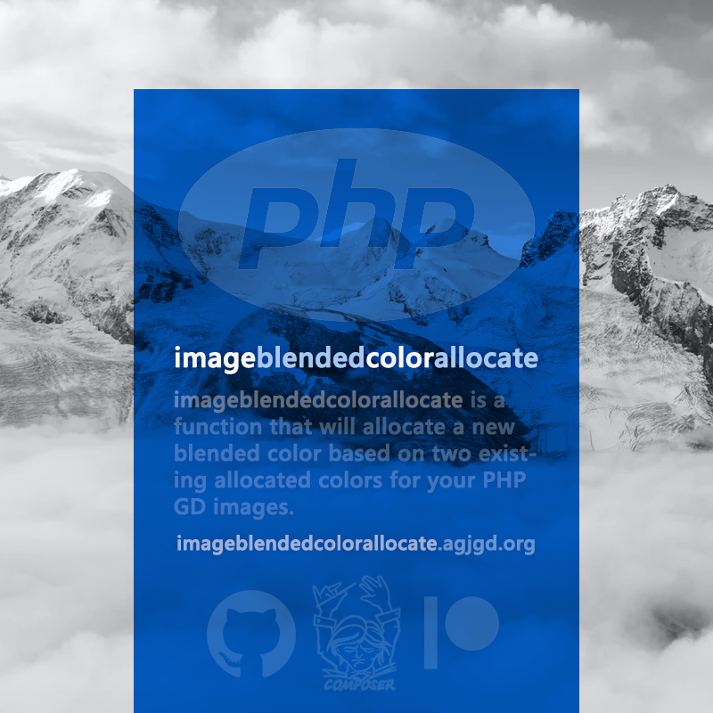

# imageblendedcolorallocate

## Description

**imageblendedcolorallocate** is a function that will allocate a new blended color based on two existing allocated colors for your PHP GD images.

As of **v2.0.0** imageblendedcolorallocate is part of [**AgjGd**](https://agjgd.org). The implementation now lives in the `\AndrewGJohnson\AgjGd` class provided by the [`andrewgjohnson/agjgd`](https://packagist.org/packages/andrewgjohnson/agjgd) package, and this package provides the standalone `imageblendedcolorallocate()` function as a thin reverse-compatibility wrapper around it.

New code should call [`\AndrewGJohnson\AgjGd::imageblendedcolorallocate()`](https://agjgd.org/methods/imageblendedcolorallocate/) directly.

**imageblendedcolorallocate** is an [agjgd](https://agjgd.org) project.

## Examples

    // Allocate red and yellow using the standard method then blend the two to allocate orange
    $red    = imagecolorallocate($im, 0xFF, 0x00, 0x00);
    $yellow = imagecolorallocate($im, 0xFF, 0xFF, 0x00);
    $orange = imageblendedcolorallocate($im, $red, $yellow);

    // You can also allocate RGBA colors as well as RGB
    $opaqueBlack      = imagecolorallocatealpha($im, 0x00, 0x00, 0x00, 0);
    $translucentBlack = imagecolorallocatealpha($im, 0x00, 0x00, 0x00, 63);
    $blendedBlack     = imageblendedcolorallocate($im, $opaqueBlack, $translucentBlack);

    // By default, we allocate with a 50/50 blend where we average the red, blue, green and alpha values for each color but also support alternative blends
    $blue              = imagecolorallocate($im, 0x00, 0x00, 0xFF);
    $cyan              = imagecolorallocate($im, 0x00, 0xFF, 0xFF);
    $blendedMostlyCyan = imageblendedcolorallocate($im, $blue, $cyan, 0.25); // 25% blue, 75% cyan
    $blendedEvenly     = imageblendedcolorallocate($im, $blue, $cyan); // 50% blue, 50% cyan
    $blendedMostlyBlue = imageblendedcolorallocate($im, $blue, $cyan, 0.75); // 75% blue, 25% cyan

There are [other examples](https://github.com/andrewgjohnson/imageblendedcolorallocate/tree/master/examples) included in the GitHub repository and on [imageblendedcolorallocate.agjgd.org](https://imageblendedcolorallocate.agjgd.org/examples/).

## Usage

### With Composer

This project offers support for the [Composer](https://getcomposer.org/) dependency manager. You can find the imageblendedcolorallocate package online on [packagist.org](https://packagist.org/packages/andrewgjohnson/imageblendedcolorallocate).

#### Install using Composer

Either run this command:

    composer require andrewgjohnson/imageblendedcolorallocate

or add this to the `require` section of your composer.json file:

    "andrewgjohnson/imageblendedcolorallocate": "^2.0"

This package requires PHP 8.0 or newer, the [GD extension](https://www.php.net/manual/book.image.php) and the [`andrewgjohnson/agjgd`](https://packagist.org/packages/andrewgjohnson/agjgd) package, which Composer installs automatically.

### Without Composer

Because `imageblendedcolorallocate()` now forwards to the `\AndrewGJohnson\AgjGd` class, you need both this wrapper and AgjGd. Composer is the recommended way to install them, but you can also require both source files directly:

    require_once 'path/to/agjgd/source/AndrewGJohnson/AgjGd.php';
    require_once 'source/imageblendedcolorallocate.php';

## Help Requests

Please post any questions in the [discussions area](https://github.com/andrewgjohnson/imageblendedcolorallocate/discussions) on GitHub if you need help.

If you discover a bug please [enter an issue](https://github.com/andrewgjohnson/imageblendedcolorallocate/issues/new) on GitHub. When submitting an issue please use our [issue template](https://github.com/andrewgjohnson/imageblendedcolorallocate/tree/master/.github/ISSUE_TEMPLATE).

## Contributing

Please read our [contributing guidelines](https://github.com/andrewgjohnson/imageblendedcolorallocate/blob/master/.github/CONTRIBUTING.md) if you want to contribute.

You can contribute financially by becoming a [patron](https://patreon.com/agjopensource) at [patreon.com/agjopensource](https://patreon.com/agjopensource) to support imageblendedcolorallocate and [other agjgd.org projects](https://agjgd.org/projects/).

## Acknowledgements

This project was started by [Andrew G. Johnson (@andrewgjohnson)](https://github.com/andrewgjohnson).

Full list of contributors:
 * [Andrew G. Johnson (@andrewgjohnson)](https://github.com/andrewgjohnson)

Our [security policies and procedures](https://github.com/andrewgjohnson/imageblendedcolorallocate/blob/master/.github/SECURITY.md) come via the [atomist/samples](https://github.com/atomist/samples/blob/master/SECURITY.md) project. Our [issue templates](https://github.com/andrewgjohnson/imageblendedcolorallocate/tree/master/.github/ISSUE_TEMPLATE) come via the [tensorflow/tensorflow](https://github.com/tensorflow/tensorflow/blob/master/SECURITY.md) project. Our [pull request template](https://github.com/andrewgjohnson/imageblendedcolorallocate/blob/master/.github/PULL_REQUEST_TEMPLATE.md) comes via the [stevemao/github-issue-templates](https://github.com/stevemao/github-issue-templates) project. The [Jekyll theme](https://github.com/andrewgjohnson/open-source-documentation-jekyll-theme) was released by [Andrew G. Johnson](https://github.com/andrewgjohnson).

## Changelog

You can find all notable changes in the [changelog](https://github.com/andrewgjohnson/imageblendedcolorallocate/blob/master/CHANGELOG.md).
